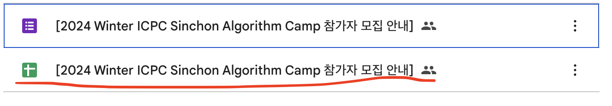
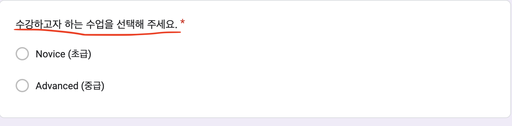
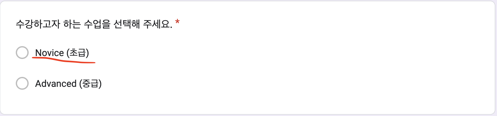
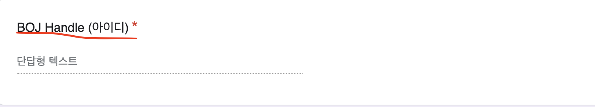

# 백준 핸들을 한번에 매크로로 그룹에 등록하는 방법입니다.

---

1. 가장 첫번째 셀은 설정 셀입니다.

`csv_name`:  
구글폼에서 가져온 .csv 파일의 이름입니다.  
위치는 해당 노트북과 같게 해주세요.  

`class_quest`:  
초급인지 중급인지 묻는 질문입니다.  
구글폼에서 그대로 복사하면 됩니다.  
ex) 24W에서 - "수강하고자 하는 수업을 선택해 주세요."  

`class_novice`:  
폼에서 고를 수 있는 선택지 중에서 초급의 이름입니다.  
역시 구글폼 혹은 .csv 에서 복사합니다.  
ex) 24W에서 - "Novice (초급)"  
띄어쓰기에 따라 달라질 수 있으니 되도록이면 복사붙여넣기 합시다.  

`class_advance`:  
폼에서 고를 수 있는 중급의 이름입니다.  
초급과 동일하니 생략합니다.  

`boj_quest`:  
구글 폼에서 백준 핸들을 묻는 질문입니다.  
역시 구글폼에서 그대로 복사해오면 됩니다.
ex) 24W에서 - "BOJ Handle (아이디)"  

그 후 전체 실행을 하면,  
초급, 중급 셀에서 각각 리스트와 총 개수가 출력됩니다.  
리스트를(개수는 복사하면 안됩니다!) 복사해서,  
마지막 셀의 `입력할 리스트 입력` 을 바꿔주시면 됩니다.  
그 후 마지막 셀을 복사하고,  
그 내용을 백준 그룹 초대 페이지에서의 콘솔에서 실행하면 됩니다.

